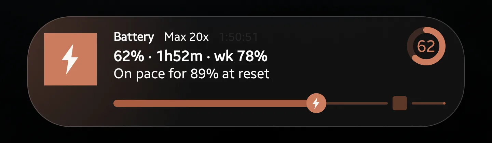
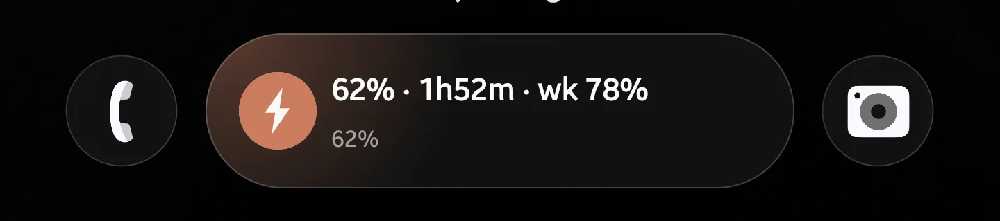
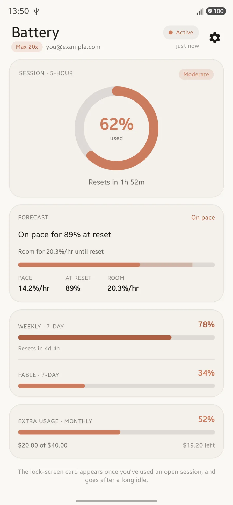
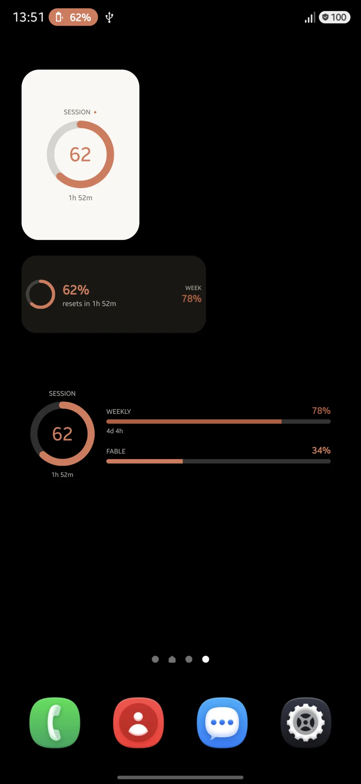

# Battery for Android — lock-screen card, widgets, and the app

The third surface, after the macOS menu bar and the iPhone. Same OAuth client,
same `/api/oauth/usage` endpoint, same terracotta.

The headline difference from iOS is one line:

```
card exists  ⟺  service running  ⟺  fast polling
```

On iOS the poll loop and the Live Activity are separate concerns reconciled by
`LiveActivityController.sync()`. Here the foreground service's notification *is*
the card, so those collapse into a single decision, and the service is doing
work the user can see for as long as it runs.

**When the card goes, the poller goes with it.** Nothing else in the app runs on
a schedule, so anything that needs to happen while no card is up has to be
somebody else's job. That somebody is `WidgetRefreshWorker`.

One arrow does not point both ways, which matters before a `dumpsys` showing a
promoted card and no `ServiceRecord` reads as a bug:

```
service running  ⟹  card exists            (the service's notification IS the card)
card exists      ⟹̸  service running        (the worker can post one on its own)
```

A foreground service justifies *continuous polling*; it is not what earns
promotion. `setOngoing` plus `setRequestPromotedOngoing` does that, and an
ordinary notification carries both — so a card revived by `WidgetRefreshWorker`
from the background is fully promoted, and refreshes on the worker's
fifteen-minute cadence rather than the service's three. `startForeground` adopts
the same notification id when the service can legitimately start again.



Six surfaces, one posted notification, no Samsung-specific code: the Now Bar
pill, the status-bar chip, the chip's floating peek, the expanded card above,
the shade entry, and the always-on display.

| | |
|:--|:--|
|  |  |

| The app | Widgets |
|:--|:--|
|  |  |

---

## Layout

```
android/
  core/    pure Kotlin/JVM — no Android dependency at all
           UsagePayload · UsageLevel · BurnRateCalculator · UsageForecast
           SessionHistory · SessionPolicy · UsageApi · ReleaseFeed
  app/     everything Android: Compose UI, auth, storage, the service, widgets
```

Because `core/` has no Android dependency, the regression, the forecast wording
and the card's state machine run as ordinary JVM tests against the fixtures in
`../fixtures/`. 101 tests, all JVM, all under two seconds.

Glance widgets need no separate module. They are a `BroadcastReceiver` in this
same APK rather than a separate codesigned extension in its own process, and
they read the payload the app already wrote — no credential is copied anywhere.

---

## The Now Bar

**Solved** — see [`NOW_BAR.md`](NOW_BAR.md), which is the long version: what
renders on which surface, how wide each one is, and the dead ends. It works on
plain AOSP APIs with no Samsung-specific code, and reaches the Now Bar pill, the
status-bar chip, the lock-screen card and the top of the shade at once.

The one catch is a switch, not an API: **Developer options ▸ "Live notifications
for all apps" ships OFF in One UI 8.5.** With it off, promotion still succeeds
and the lock-screen card still appears; only the Now Bar and the chip are
missing, and the card degrades to an ordinary sticky notification.

It **can** be detected at runtime. It writes `Settings.Secure`
`enable_notification_nowbar_test`, which any app can read, so `NowBarGate`
reports four states and the dashboard shows guidance only when it applies:
`ENABLED` (say nothing), `DISABLED` (deep-link to Developer options),
`DEVELOPER_OPTIONS_OFF` ("tap Build number seven times"), and `NOT_APPLICABLE`
— key absent, so a non-Samsung device is never sent hunting for a Samsung
setting. Writing it needs `WRITE_SECURE_SETTINGS` and stays impossible.

### What goes where

Three surfaces, fed by three fields, with very different room:

| Field | Renders |
|---|---|
| `setContentTitle` | Now Bar pill line 1, and the shade/expanded title. ~23 chars |
| `setShortCriticalText` | the status-bar chip **and** the pill's line 2 — one string, two surfaces. The chip caps around **10 glyphs**, then ellipsis, then marquee |
| `setContentText` | the expanded card and the shade only |
| `setLargeIcon` | the expanded card's badge. Ignored by the collapsed pill |
| `ProgressStyle` | the expanded card and the shade |

Expanding the chip opens the same expanded card the pill does, so there is one
detailed layout to design rather than three.

---

## Build and run

```bash
cd android
./gradlew :core:test          # the fixtures — fast, and the first thing to break
./gradlew :app:assembleDebug
./gradlew :app:installDebug
```

Requires **JDK 17+** and **compileSdk 37**. CI installs `platforms;android-37`
explicitly when the runner image lacks it; locally, Android Studio or
`sdkmanager` will fetch it. The build targets 17 bytecode without pinning a
toolchain, so any modern JDK works.

- `minSdk 31` — the app installs from Android 12.
- `targetSdk 36` — matches the device.
- **The lock-screen card needs API 36.** Below that everything else still works;
  the card is gated at runtime, not in the manifest.

### Diagnostics

Debug builds only: the Settings sheet's *Diagnostics* row opens a harness that
posts a card at any percentage on demand, reads
`canPostPromotedNotifications` / `hasPromotableCharacteristics` /
`FLAG_PROMOTED_ONGOING` / `feature.nowbar`, and deep-links to the system's
promoted-notification settings. Posting at 91% on demand is how the escalation
paths are tested without waiting for a real session.

`SpikeActivity` is `exported=false`, so `adb am start` cannot reach it — go
through the app.

---

## CI

`.github/workflows/android-ci.yml` runs `:core:test` and `:app:assembleDebug` on
`ubuntu-latest`.

It is a separate file from `ci.yml` because `ci.yml` runs on `macos-26` and
fires only on `main` and pull requests against it. Widening its triggers would
spend macOS minutes on pushes that cannot affect the Mac or iOS builds, and a
long-lived `android/**` branch would otherwise get no CI until the moment it is
proposed for merge.

> **`workflow_dispatch` only appears for workflows on the repository's default
> branch.** A workflow that exists only on a feature branch has no "Run
> workflow" button and `gh workflow run` returns 404, because it resolves the
> workflow by name against the default branch. Push triggers are the exception —
> including tag pushes, which is why the release workflow works from a tag on a
> branch that has never been merged.

---

## Releasing

```bash
git tag android-v0.1.0 && git push origin android-v0.1.0
```

`.github/workflows/android-release.yml` builds, signs, and publishes the APK to
GitHub Releases. `android-v*` is a third tag namespace beside `v*` (Mac) and
`ios-v*` (iOS), for the same reason `ios-v*` exists — the three ship on their own
cadences.

`versionName` comes from the tag and `versionCode` from the commit count, so
there is no second place to remember to bump. Local builds fall back to the
literals in `app/build.gradle.kts`.

### Secrets

Four, all repository-level. **None are shared with the Mac or iOS releases** —
those use Apple certificates, which cannot sign an APK.

| Secret | What it is |
|---|---|
| `ANDROID_KEYSTORE` | base64 of the release `.jks`, newlines stripped |
| `ANDROID_KEYSTORE_PASSWORD` | store password |
| `ANDROID_KEY_ALIAS` | key alias inside the store |
| `ANDROID_KEY_PASSWORD` | key password — **see the trap below** |

```bash
keytool -genkeypair -v -keystore release.jks -alias battery \
  -keyalg RSA -keysize 4096 -validity 10000 \
  -storepass 'PASS' -keypass 'PASS' -dname "CN=Battery"

# tr -d '\n' matters: macOS base64 wraps lines by default.
base64 -i release.jks | tr -d '\n' | gh secret set ANDROID_KEYSTORE --repo OWNER/REPO
```

> **The store password and the key password must be the same.** keytool's
> default format since JDK 9 is PKCS12, which has no separate key encryption.
> Pass a different `-keypass` and it prints `Ignoring user-specified -keypass
> value` and protects the key with the *store* password instead — so a
> reasonable-looking set of four secrets fails at `:app:packageRelease` with
> `Given final block not properly padded`, two minutes into the build.
>
> `keytool` will not catch this either: it ignores `-keypass` on read commands
> too, so a keytool-based check passes with the wrong password. The workflow's
> `Verify signing credentials` step uses the `KeyStore` API directly —
> `ks.getKey(alias, keyPassword)`, which is what AGP calls — and fails in
> seconds with an explanation.

> **The keystore is permanent.** Android has no key rotation for sideloaded
> APKs: a build signed with key A can never be updated by one signed with key B —
> users have to uninstall, losing their data and their sign-in. Whoever generates
> this key owns the app's identity for as long as the app exists. Decide who that
> is *before* the first release, not after.

The workflow shreds the decoded keystore in an `if: always()` step, so a failed
build doesn't leave a signing key in the runner's temp directory.

`assembleRelease` works locally without any of this — the signing config falls
back to the debug key when `BATTERY_KEYSTORE` is unset, so you can build and
install a release APK on your own device without holding the real key.

### Updates

A sideloaded APK has neither Sparkle nor TestFlight, so `UpdateChecker` polls the
GitHub releases feed. It is deliberately **check-and-hand-off**: it opens the
release page rather than downloading and installing, because installing would
mean holding `REQUEST_INSTALL_PACKAGES` — a permission that lets an app install
arbitrary software.

---

## Notes for anyone changing this

- **`core/` must not gain an Android dependency.** The moment it does, the shared
  fixture story is over and `SessionPolicy` stops being testable.
- **Every string about a projection comes from `UsageForecast`.** A second local
  helper means the lock-screen card and the in-app card can disagree about the
  same payload.
- **Never repost a dismissed card.** `CardDismissal` enforces it. Reposting is
  what drives users to revoke promotion, and that revocation is effectively
  permanent.
- **The foreground service is `specialUse`, not `dataSync`.** `dataSync` is capped
  at 6h per 24h on Android 15+ and the system *throws* at the limit rather than
  degrading.
- **Widgets do not tick.** A Glance widget is a `RemoteViews` tree built once and
  frozen, so "resets in 2h 13m" is a string sampled at composition. Only
  `WidgetRefreshWorker` re-renders it, and it is also what brings the card back
  after `SessionPolicy` has stood the service down — see the note at the top.
- **Call `refreshAllWidgets` at most once per event.** Glance composes each
  widget in its own WorkManager session; a second call while the first is still
  composing cancels it, and both repaints are lost. Nothing throws.
- **Anything about the notification's rendering belongs in `NOW_BAR.md`, and it
  belongs there measured.** Prefer one screenshot to any amount of reasoning
  about One UI.
- **Fixtures are the specification.** If `../fixtures/` disagrees with
  `Tests/BatteryTests/`, the fixture is wrong — fix it there first, then fix
  whichever implementation drifted.
